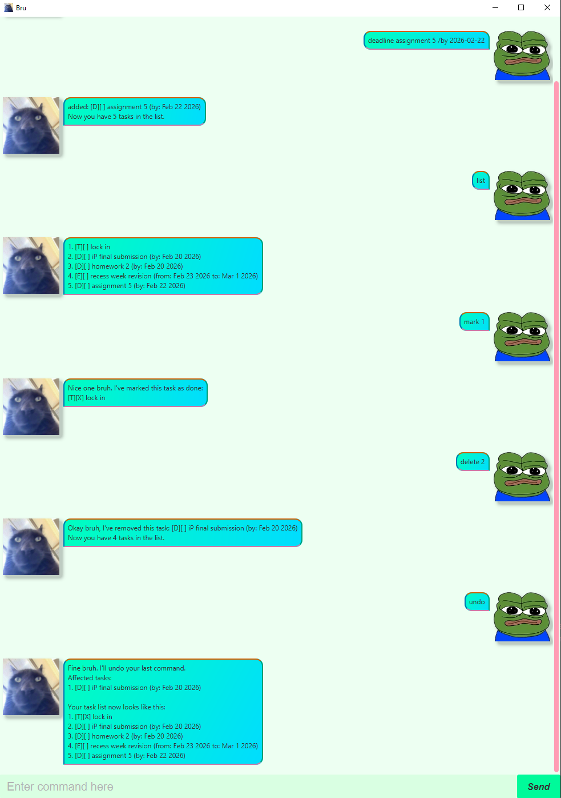

# Bru User Guide

Bru is a desktop app for tracking tasks. You can add, mark, and delete tasks, and also undo any mistakes along the way.

## Command Summary

| Command  | Format                              | Example                                                         |
|----------|-------------------------------------|-----------------------------------------------------------------|
| Todo     | `todo TASK`                         | `todo CS2101 reading`                                           |
| Deadline | `deadline TASK /by DATE`            | `deadline Drop with W grade /by 2026-03-01`                     |
| Event    | `deadline TASK /from START /to END` | `event SU Declaration Exercise /from 2025-12-23 /to 2025-12-25` |
| List     | `list`                              |                                                                 |
| Find     | `find TASK_DESCRIPTION`             | `find homework`                                                 |
| Mark     | `mark TASK_NUMBER`                  | `mark 2`                                                        |
| Unmark   | `unmark TASK_NUMBER`                | `unmark 3`                                                      |
| Delete   | `delete TASK_NUMBER`                | `delete 1`                                                      |
| Undo     | `undo`                              |                                                                 |
| Bye      | `bye`                               |                                                                 |

## Adding todo tasks

Adds a generic todo task.

Format: `todo TASK`

Example: `todo CS2101 reading`

## Adding deadline tasks

Adds a task with a deadline.

Format: `deadline TASK /by DATE`
- `DATE` must be in the format `yyyy-mm-d`

Example: `deadline assignment 3 /by 2026-02-07`

## Adding event tasks

Adds a task occurring over a period of time.

Format: `event TASK /from START /to END`
- `START`/`END` must be in the format `yyyy-mm-dd`
- `START` cannot be chronologically after `END`

Example: `event recess week grind /from 2026-02-23 /to 2026-03-01`

## Listing tasks

Displays every task in the task list.

Format: `list`

## Finding tasks

Finds tasks which contain the given description.

Format: `find TASK_DESCRIPTION`
- Tasks whose description is a superstring of `TASK_DESCRIPTION` will be shown

Example: `find homework`

## Marking tasks

Marks a task as complete.

Format: `mark TASK_NUMBER`
- `TASK_NUMBER` must not be greater than the number of tasks in the list
- A task which is already marked will remain marked

Example: `mark 2`

## Unmarking tasks

Marks a task as incomplete.

Format: `unmark TASK_NUMBER`
- `TASK_NUMBER` must not be greater than the number of tasks in the list
- A task which is not yet marked will remain unmarked

Example: `unmark  3`

## Deleting tasks

Deletes a task from the task list.

Format: `delete TASK_NUMBER`
- `TASK_NUMBER` must not be greater than the number of tasks in the list

Example: `delete  1`

## Undoing commands

Undoes the last command which modified the task list.

Format: `undo`
- There must be at least 1 command, which modified the task list, in the command history.
- Once a command is undone, it is considered removed from the command history.

## Closing the program

Closes the program after a brief delay.

Format: `bye`